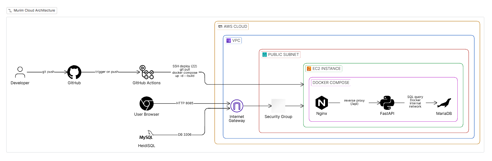

# Murim Cloud

AWS EC2 환경에서 Nginx, FastAPI, MariaDB를 Docker Compose로 운영하고,  
GitHub Actions 기반 CI/CD와 Terraform 기반 IaC를 적용한 인프라 실습 프로젝트입니다.

## Project Overview

이 프로젝트는 단일 EC2 환경에서 웹 계층, 애플리케이션 계층, 데이터 계층을 분리 운영하고,  
GitHub Actions를 통해 자동 배포를 수행하며, Terraform으로 AWS 인프라를 코드로 관리하는 것을 목표로 했습니다.

## Objectives

- 웹 / 애플리케이션 / 데이터 계층 분리 운영
- GitHub Actions 기반 자동 배포 파이프라인 구축
- Terraform을 활용한 AWS 인프라 코드화
- 트러블슈팅 경험 문서화를 통한 운영 관점 강화

## Architecture



## Tech Stack

### Cloud / Infra
- AWS EC2
- VPC
- Public Subnet
- Internet Gateway
- Route Table
- Security Group
- Terraform

### Container / App
- Docker
- Docker Compose
- Nginx
- FastAPI
- MariaDB

### CI/CD
- GitHub Actions
- SSH
- GitHub Secrets

## Repository Structure

```text
.
├── .github/
│   └── workflows/
│       └── deploy.yml
├── backend/
├── frontend/
├── terraform/
├── docs/
│   ├── architecture.png
│   ├── github-actions.png
│   ├── terraform-apply.png
│   ├── aws-ec2-sg.png
│   └── docker-ps.png
├── docker-compose.yml
├── nginx.conf
└── README.md
